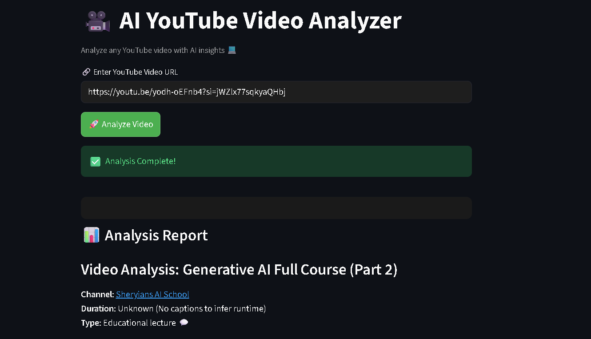
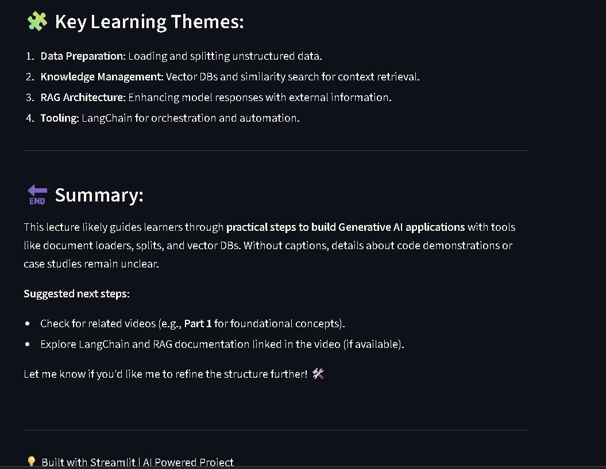

# 🎥✨ AI YouTube Video Analyzer

🚀 Analyze any YouTube video using AI and get powerful insights like **summary, key points, and detailed analysis** in seconds.

---

## 🌐🚀 Live Demo  
👉 https://youtubeanalyseragent-bnrcvjh9zyqu2l3cvakqsz.streamlit.app

---

## 📸👀 Preview  

---

## ✨🔥 Features  

- 🔗 Paste any YouTube video link and analyze instantly  
- 🧠 AI-powered smart summary & insights  
- ⚡ Fast, smooth, and responsive experience  
- 🌙 Modern dark UI for better readability  
- ☁️ Fully deployed on Streamlit Cloud  

---

## 🛠️⚙️ Tech Stack  

- 🐍 Python  
- 🎨 Streamlit  
- 🤖 Grow API  
- 📺 YouTube Transcript API  

---

## 🚀💡 How It Works  

1. 🔗 Enter a YouTube video URL  
2. 🤖 AI processes the video transcript  
3. 📊 Get detailed insights and summary instantly  

---

## 🔮🚀 Future Enhancements  

- 📺 Video thumbnail preview  
- 📄 Export analysis as PDF  
- 💬 Chat with video (AI assistant)  
- 📊 Sentiment & topic analysis  

---

## 🤝💙 Contributing  

Contributions are always welcome!  
Feel free to fork this repo and improve it 🚀  

---

## 👨‍💻 Author  

**Ankit Gupta**  
🚀 AIML Engineer  

#### ⭐🌟 Support  

If you found this project helpful, give it a ⭐ on GitHub and share it!  

---
